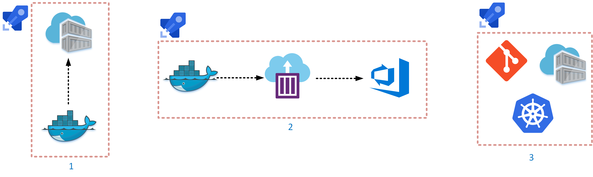

# Bedrock Build Agent

This repository is a working example of a complimentary method to practice Bedrock principles. Instead of attaching boilerplate Bedrock components on to pipeline that must be fetched each run, instead we package these items in a Docker image along with environment variables on a custom Azure Pipelines build agent. This eliminates the need to download components each pipeline run and allows for tigher coupling of a customers tools with Bedrock.

## What's inside? 🎁

- A Dockerfile that steps up an Azure Pipelines build agent environment with:
  - Helm
  - Fabrikate
  - Bedrock CLI (SPK)
  - Custom version of Bedrock [build.sh](https://raw.githubusercontent.com/microsoft/bedrock/master/gitops/azure-devops/build.sh) file (globally symlinked)
  - Azure CLI (with Azure DevOps extension)
  - Terraform
  - Scripts to connect to an Azure DevOps organization and register as a custom build agent
- A script to create necessary variables for Azure Pipelines
- A script to build the Dockerfile and push to ACR
- A script to deploy custom build agent image to Azure Container Instance with secure environment variables
- An Azure Pipelines yaml file that will validate that existence of aforementioned applications in the custom build agent

## What this unlocks 🍾

- The ability to pin specific versions of tooling in the Bedrock CI/CD infrastructure.
- The ability to run Bedrock workflows in a restricted environment
- The ability to simplify Bedrock CI/CD pipelines
- The ability to canary test new versions of Bedrock tooling
- The ability to streamline secrets management

## Steps

1. Edit and execute `setup-variable-group.sh`
2. Create a pipeline for `build-image.yaml`
3. Create a pipeline for `provision-build-agent.yaml`
4. Create a pipeline for `bedrock-pool-pipelines.yaml`

## Additional Thoughts

- Custom build agents allow Bedrock infrastructure to become a layering exercise. When customers can blend their own CI/CD tooling with Bedrock components then Bedrock blends into the background. Any customer who wants to deploy Bedrock as scale (or earnestness) should be using this method.

- This example places the build agents on ACI but a customer could just as easily set this up on AKS. The only additional complexities would be creating a Helm chart, Fabrikate defintion, and dealing with potential secrets.

## Customer POV

- An Operations team gets to control the secrets. They can control building of an image that has particular secrets in it. The Ops teams can revoke the secrets at any time, rendering a image useless. Of they want to rotate secrets, all it takes is an ACI restart.

- A customer can canary test new versions of Bedrock tooling while running theoir existing setups side by side. This is useful for organizations to be able to move at thier own pace when adopting OSS.
